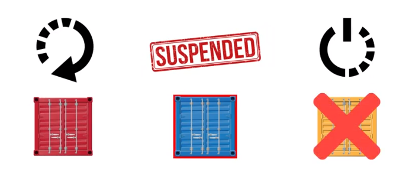
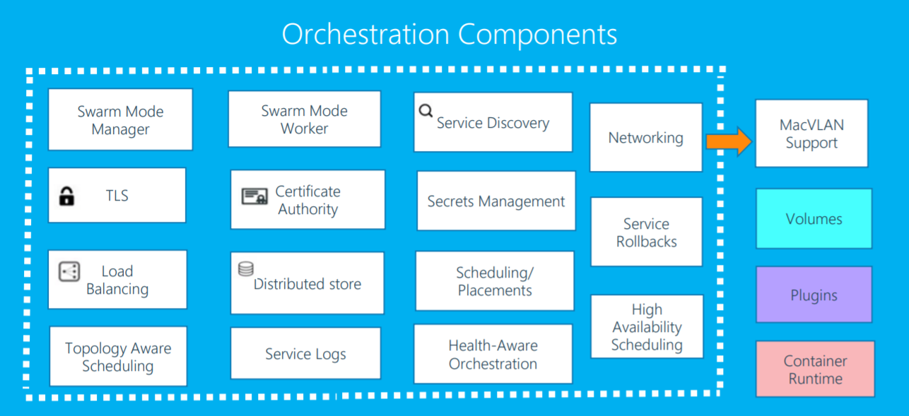
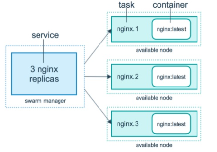
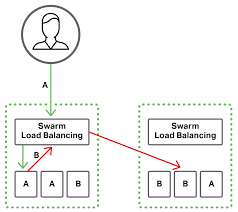
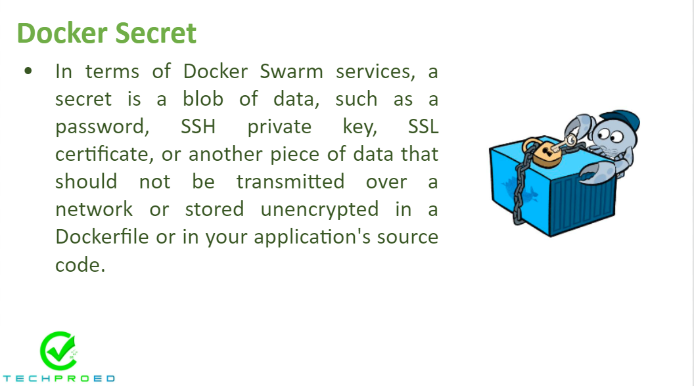

- Isletme buyukse Kubernetes kucukse(KOBI gibi) Docker Swarm is fine


# What is Docker Swarm?

<p align="center">
  
</p>

## Orchestration
- The `portability and reproducibility` of a containerized process means we have an opportunity to `move and scale` our containerized applications across clouds and data centers. 
- Furthermore, as we scale our applications up, we’ll want some tooling to help automate the maintenance of those applications, able to replace failed containers automatically and manage the rollout of updates and reconfigurations of those containers during their lifecycle.
- Containers are great, but when you get lots of them running, at some point, you need them all working together in harmony to solve business problems.




- Docker Swarm is a container orchestration tool built and managed by Docker, Inc. 
- It is the native clustering tool for Docker. 
- Swarm uses the standard Docker API, i.e., containers can be launched using normal docker run commands and Swarm will take care of selecting an appropriate host to run the container on. 
- The tools that use the Docker API can use Swarm without any changes and take advantage of running on a cluster rather than a single host.




# But why do we need Container orchestration System?

Imagine that you had to run hundreds of containers. You can easily see that if they are running in a distributed mode, there are multiple features that you will need from a management angle to make sure that the cluster is up and running, is healthy and
more.

Some of these necessary features include: NEDEN ORCHESTRATION'A IHTIYACIMIZ VAR?

● Health Checks on the Containers <br>
● Launching a fixed set of Containers for a particular Docker image<br>
● Scaling the number of Containers up and down depending on the load<br>
● Performing rolling update of software across containers<br>
● and more…<br>

Docker Swarm has capabilities to help us implement all those great features - all through simple CLIs.


# What is Docker Swarm?

- Docker Swarm is a container orchestration tool built and managed by Docker, Inc.
- It is the native clustering tool for Docker.
- Swarm uses the standard Docker API, i.e., containers can be launched using normal docker run commands and Swarm will take care of selecting an appropriate host to run the container on.
- The tools that use the Docker API—such as Compose and bespoke scripts—can use Swarm without any changes and take advantage of running on a cluster rather than a single host.


# How does Swarm Cluster look like?


```
Node: AWS te ayaga kaldirdigimiz makinalar(Docker jargonunda)
Cluster: Yonettigimiz container /  node grouplari
```
A swarm is a group of machines that are running Docker and joined into a cluster. After that has happened, we continue to run the Docker commands we’re used to, but now they are executed on a cluster by a swarm manager. The machines in a swarm can be physical or virtual. After joining a swarm, they are referred to as nodes.

Swarm managers are the only machines in a swarm that can execute your commands, or authorize other machines to join the swarm as workers. Workers are just there to provide capacity and do not have the authority to tell any other machine what it can and cannot do.

Up until now, you have been using Docker in a single-host mode on your local machine. But Docker also can be switched into swarm mode, and that’s what enables the use of swarms. Enabling swarm mode instantly makes the current machine a swarm manager. From then on, Docker runs the commands you execute on the swarm you’re managing, rather than just on the current machine.

Swarm managers can use several strategies to run containers, such as “emptiest node” -- which fills the least utilized machines with containers. Or “global”, which ensures that each machine gets exactly one instance of the specified container. 

A swarm is made up of multiple nodes, which can be either physical or virtual machines. The basic concept is simple enough: run docker swarm init to enable swarm mode and make our current machine a swarm manager, then run docker swarm join on other machines to have them join the swarm as workers. 

## Raft consensus in swarm mode

- Swarm birden fazla manaegr node destekler ve bu sayade yüksek erişilebilirliği sağlar.  Bir managerda sorun olursa diğer manager devreye girer ve proses devam eder.
- Bu manager nodelardan yalnızca bir tanesi lider olarak seçilidir ve tüm yönetim lider tarafından yapılır. Diğer manager nodelar pasif durumdadır. Siz pasif manager nodeların birine bir komut verip iş yapmasını isterseniz bu sadece proxy görevi görür ve komutu lider node a iletir.
-Ortamda birden fazla manager node olduğu durumlarda bir adet lider seçilmelidir. Swarm bunu otomatik olarak halleder ve bunun için Raft Consensus algoritmasını kullanır. Raft algoritması lider seçimi için kuralları belirler. Örnegin ortamda 5 manager olan bir durumda lider node bir şekilde ulaşılamaz hale gelirse belirli bir zaman sonra kalan 4 tane kendi aralarında oylama yaparak bir lider belirler ve artık swarm cluster ın yönetimi bu yeni lider tarafından sağlanır.
- Raft algoritması maksimum (N-1) / 2 sayıda replikanın devre dışı kalmasını tolere eder. Örnegin 5 swarm manager olarak kurgulanan bir yapıda 2 manager devre dışı kalırsa kalan 3 node kendi aralarında anlaşarak çalışmaya devam edecektir. Fakat 3 node devre dışı kalırsa kalan 2 node çoğunluğu sağlayıp anlaşacakları için sorun çıkacak ve managent altyapısı çalışmayacaktır.
- Raft algoritmasını düzgün çalışabilmesi ve lider seçiminin sorunsuz olabilmesi için ortamın her zaman tek sayıda manager nodela kurulmuş olması gerekir.Bu nedenle Docker Swarm 1,3,5,7 manager ile kurulmalıdır. 7 Fazla olduğunda işler karışabiliyor. 


---
## Practice 1 - Launch Docker Machine Instances and Connect with SSH
---
- 5 adet free tier instance olusturuyoruz. (`Configure Instance` kisminda `Number of Instances`=5 ve user data kismina da `install-docker.sh` daki kodu yapistir.)


## Practice 2 - Set up a Swarm Cluster with Manager and Worker Nodes

- Prerequisites (Those prerequisites are satisfied within cloudformation template in Part 1)

  - Five EC2 instances on Amazon Linux 2 with `Docker` and `Docker Compose` installed.

  - Set these ingress rules on your EC2 security groups:

    - HTTP port 80 from 0.0.0.0\0

    - TCP port 2377 from 0.0.0.0\0

    - TCP port 8080 from 0.0.0.0\0

    - SSH port 22 from 0.0.0.0\0 (for increased security replace this with your own IP)

- Change the hostname  of the nodes, so we can discern the roles of each nodes. For example, you can name the nodes (instances) like master, worker-1 and worker-2.

```bash
sudo hostnamectl set-hostname <node-name-manager-or-worker>
bash
# Ornek
sudo hostnamectl set-hostname manager-2
bash
```

- Check if the docker is active or not from the list of docker info (should be inactive at first).

```bash
docker info | grep -i swarm
```

- Get the internal IP addresses of docker machines,  you find out the Private IPs either on the EC2 dashboard, or from the command line by running the following command. Response should be something like `172.31.42.71`.

```bash
# Bulundugun makinenin IP'sini almak istersen
hostname -i
```

- Initialize `docker swarm` with Private IP and assign your first docker machine as manager:

```bash
docker swarm init

Swarm initialized: current node (igfhs30j4r72yy4xn2n1ye1q4) is now a manager. # Dediyse artik ana liderini belirledin H.O.
# Ayrica ciktida diyor ki worker eklemek istersen sunu yaz:
To add a worker to this swarm, run the following command:

    docker swarm join --token SWMTKN-1-50341tpjuxdvq8h4zwz3e4dwe3itskyc0znw86u0vwyqrp1y0l-5mtfo2fyupy5f7wkui1qq1rnn 172.31.94.105:2377
    # Yukaridaki kodu worker-1 ve worker-2'ye yapistir. Yapistirdiktan sonra su ciktiyi almalisin:
    This node joined a swarm as a worker.

# Peki bizim simdi burada 5 adet makinemiz var; basta 3 unu manager 2 sini worker belirledik. 1 Manager'a ve 2 worker'a manager ve worker olduklarini soyledik. Peki geri kalan 2 manager'a yedek manager'lar olduklarini nasil soyleyecegiz? Soyle:
# Ana manager olarak set ettigin makinenin manager set etme komutunun ciktisinda soyle birsey olmali:
To add a manager to this swarm, run 'docker swarm join-token manager' and follow the instructions. # docker swarm join-token manager komutunun ciktisini yapistir yedek manager ilan etmek istedigin container veya makinelere
```
- Ilk Manager'in ciktisini kaybettim ve worker ilan etme ciktisina erismek istiyorum diyorsan: `docker swarm join-token worker`
- Ilk Manager'in ciktisini kaybettim ve manager ilan etme ciktisina erismek istiyorum diyorsan: `docker swarm join-token manager`

- Check if the `docker swarm` is active or not and explain the swarm part of `docker info`.

```bash
docker info | grep -i swarm

# Cikti su olmali:
 Swarm: active
```

- (Yukarida yaptik bunu)Add 2 more nodes as manager to improve fault-tolerance. It is recommended to create clusters with an odd number of managers in Swarm, because a majority vote is needed between managers to agree on proposed management tasks according to `Raft Algorithm`. An odd—rather than even—number is strongly recommended to have a tie-breaking consensus. Having two managers is actually worse than having one.

- List the connected nodes in `Swarm` and explain difference between leader and other managers.

```bash
docker node ls
```
- Worker olan node'u manager'a terfi ettirmek istiyorsan:

```bash
docker node promote
# Diger docker node komutlarini da gormek istersen docker node --help
```
---
## Docker Swarm Definitions

### Nodes : 
- The docker swarm function recognizes two types of nodes, each with a different role within the docker swarm ecosystem:

    - `Manager Node`: The primary function of manager nodes is to assign tasks to worker nodes in the swarm. Manager nodes also help to carry out some of the managerial tasks needed to operate the swarm. Docker recommends a maximum of seven manager nodes for a swarm. 

    - `Worker Node`: In a docker swarm with numerous hosts, each worker node functions by receiving and executing the tasks that are allocated to it by manager nodes. By default, all manager nodes are also worker nodes and are capable of executing tasks when they have the resources available to do so.

    - `Services and Tasks`: A service is the definition of the tasks to execute on the manager or worker nodes. It is the central structure of the swarm system and the primary root of user interaction with the swarm. **Servisi ayni uygulamalari beraber calistirdiginiz bir container grubu olarak dusunebiliriz.** Servisin icerisindeki herbir container'in calistirilmasina da **task** diyoruz. Bundan sonra olusturacagimiz seyleri hep servis olarak olusturacagiz.  

    - `Load balancing`: The swarm manager uses ingress load balancing to expose the services you want to make available externally to the swarm.Trafigin yogunluguna bagli olarak kullanicilari container(node)'lara dagitma islemi aslinda `load balancing`; trafik polisi gibi dusunebilirsiniz.(Bunu biz yapmiyoruz Docker Swarm kendisi hallediyor) Docker Swarm'in node balancing gorevi de var. 
---
## Practice - Managing Docker Swarm Services
---
> Warning: If you have problem with `docker swarm` installation, you can use following link for lesson.
https://labs.play-with-docker.com

- Create a service for visualization. 

```bash
# Container veya Container'lar olusturacaksak artik kullanmamiz gereken komut docker service create
docker service create --name=viz --publish=8080:8080/tcp --constraint=node.role==manager --mount=type=bind,src=/var/run/docker.sock,dst=/var/run/docker.sock dockersamples/visualizer
```

- Learn which node is running `service viz` and check if the visualizer is running by entering `http://<ec2-host-name of this node>:8080` in a browser. (Nothing should be running)

```bash
docker service ps viz
# Hangi manager'da calisiyorsa o manager'in bagli oldugu instance'in publicIP'si ve 8080 tarayiciya yazilir(3.86.183.108:8080 gibi)
```

- Start an `nginx service` with 5 replicas and show the replicas running on visualizer.

```bash
docker service create --name webserver --replicas=5 -p 80:80 -d nginx
# service'in ismi webserver 5 adet kopyasi(replicasi) var 80 de publish edilecek detach modda nginx image'ini indir
# replicas = 5 cunku 5 tane servis(bizim durumumuzda makine) ayaga kaldirdik

docker service ps webserver
#Node'larin hangilerinde webserver'i olusturmus; hepsinde
ID             NAME          IMAGE          NODE        DESIRED STATE   CURRENT STATE            ERROR     PORTS
a3yyw5fxgkdd   webserver.1   nginx:latest   worker-1    Running         Running 52 seconds ago
afsq48k173mb   webserver.2   nginx:latest   worker-2    Running         Running 51 seconds ago
m4a4al5oywpm   webserver.3   nginx:latest   manager-1   Running         Running 52 seconds ago
ja2nibng6815   webserver.4   nginx:latest   manager-3   Running         Running 51 seconds ago
x48tfsytze72   webserver.5   nginx:latest   manager-2   Running         Running 52 seconds ago

# visualizer'i ac bak(tarayicidaki) bakalim webserver'lar da gelmis mi
```

- List services, explain what service is and the difference between container and service.

```bash
docker service ls # calisan servislerin ozetleri
```

- Check if the `Nginx Web Server` is running by entering `http://<ec2-host-name-of-any-node>` in a browser.

- Display detailed information on service.

```bash
docker service inspect --pretty webserver
```

- List the tasks of service and explain what task is.

```bash
docker service ps webserver
```

- Fetch the logs of the service or a task.

```bash
docker service logs webserver
```

- Reboot a worker node and explain the last situation on visualizer app.

```bash
# Instance'in birini(worker-1 olsun) yeniden baslatalim
sudo reboot -f
# Visualizer'dan gordugumuz uzere worker-1 gitmis ve worker-2 de yeniden bir container olusturmus. Ne zamana kadar? reboot islemi tamamlanincaya kadar
```

- Scale up services and show the changes on visualizer app.

```bash
# manager-1 e gelip assagidaki komutu yaz
docker service scale webserver=10
# Visualizer'a git
# Gordugunuz gibi 10 gorevi esit bir sekilde bolusturmus
```

- Scale down services and show the changes on visualizer app.

```bash
# 10 olan service sayisini 3 e dusurelim
docker service scale webserver=3
```

- Remove service and show the changes on visualizer app.

```bash
# Webserver servislerini ucuralim
docker service rm webserver
```


- Create service in `global mod`, show the changes on visualizer app and explain `global mod`.
- Kac tane makinemiz varsa ona gore calistirsin, manuel makine acmayalim 

```bash
docker service create --name glbserver --mode=global -p 80:80 nginx
# burada replicas = 5 degil --mode=global dedik yani bu ne demek ihtiyaca gore servis(bizim durumumuzda makine) ayaga kaldir

overall progress: 5 out of 5 tasks
livof1k5f7m9: running   [==================================================>] 
igfhs30j4r72: running   [==================================================>]
ffbk83dux5yi: running   [==================================================>]
xrlue9cobj30: running   [==================================================>]
rlmvnkn2dm6i: running   [==================================================>]
verify: Service converged 
# Gordugunuz gibi napti node sayima gore servisi ayaga kaldirdi
```

- Remove a container and show that swarm creates a new task immediately.

```bash
# Manager 1 teki container'i silelim mesela
docker container rm -f <containerid>
# Visualizer'a geri gel; napti hemen yenisini baslatti. Olur da manager cokerse hemen yenisini baslatacak
docker service ps glbserver # container gecmisi
```

- Leave worker nodes from swarm and show the changes on visualizer app.

```bash
docker swarm leave # bu simdilik dursun; calistiracak olsan bile manager-1 de calistirma viz onun icinde cunku
```

- Remove the `glbserver` service.

```bash
docker service rm glbserver
# SERVICE'I DURDURMAK ICIN; YAZ BUNU BI KENARA ONEMLI
```

- Leave manager nodes from swarm

```bash
docker swarm leave --force # bu simdilik dursun
```

- Join manager and worker nodes again.

```bash
docker swarm join --token SWMTKN-1-1nkizkzhhqk4i7blzwww3znwhd0lqfsu3nlh9gl1pe7mco84up-5468yx80p9nfowv4eck0dqrvd 172.31.38.249:2377 # bu simdilik dursun
```

## Practice - Updating and Rolling Back in Docker Swarm

- Create a new service of `gluobe/container-info:green` with 10 replicas.

```bash
docker service create --name techproedweb -p 80:80 --replicas=10 gluobe/container-info:green
# Visualizer'a git. Gordugumuz gibi hepsinde techproedweb calisiyor arkadaslar
# Herhangi birinin Public IP sini al ve tarayciya yapistir
```
- Simdi biz bu uygulamayi olusturduk ancak degisiklik yapmak istiyoruz, napmamiz lazim? `docker service update` i kullanmamiz lazim

```bash
docker service update --help # update komutlarini ogrenmek icin
```

- Update `gluobe/container-info:green` image with `gluobe/container-info:variable` image and explain the changes.

```bash
docker service update --detach --update-delay 5s --update-parallelism 2 --image gluobe/container-info:variable techproedweb
# cikmak icin crtl c
# docker service ps techproed komutun degisimini 5 sn de bir bana gozle
# update parallelism 2 : 2 container'da bir bu islemi yap
# gluobe/container-info:variable techproedweb image'inda degisiklik yap yani update et
watch docker service ps techproedweb

2851uletlvgv   techproedweb.1       gluobe/container-info:green      manager-2   Running         Running 7 minutes ago
v880yy2lyw56   techproedweb.2       gluobe/container-info:variable   manager-3   Running         Running 3 seconds ago
8s2glyqggsed    \_ techproedweb.2   gluobe/container-info:green      manager-2   Shutdown        Shutdown 4 seconds ago
mna19axnmx4y   techproedweb.3       gluobe/container-info:variable   manager-1   Running         Running 12 seconds ago
ulczimln13rf    \_ techproedweb.3   gluobe/container-info:green      manager-1   Shutdown        Shutdown 13 seconds ago
jtwt5ys3y5cx   techproedweb.4       gluobe/container-info:variable   manager-2   Running         Running 3 seconds ago
xce9hecyhpdc    \_ techproedweb.4   gluobe/container-info:green      manager-3   Shutdown        Shutdown 4 seconds ago
gxdaniz680t0   techproedweb.5       gluobe/container-info:variable   worker-1    Running         Running 22 seconds ago
nq7vp6yhttew    \_ techproedweb.5   gluobe/container-info:green      worker-1    Shutdown        Shutdown 23 seconds ago
nagpzv6m26dl   techproedweb.6       gluobe/container-info:variable   worker-1    Running         Running 12 seconds ago
ubbeuwwm7foz    \_ techproedweb.6   gluobe/container-info:green      worker-1    Shutdown        Shutdown 14 seconds ago
ynw99ytnngng   techproedweb.7       gluobe/container-info:green      worker-2    Running         Running 7 minutes ago
os3td2rlyoim   techproedweb.8       gluobe/container-info:variable   worker-2    Running         Running 22 seconds ago
kgxdiyyjnvtr    \_ techproedweb.8   gluobe/container-info:green      worker-2    Shutdown        Shutdown 23 seconds ago
ji1b0cks9cs2   techproedweb.9       gluobe/container-info:green      manager-3   Running         Running 7 minutes ago
jyoex9nvg2qn   techproedweb.10      gluobe/container-info:green      manager-1   Running         Running 7 minutes ago

# Yukarida goruldugu gibi gozleniyor..
 ```

- Revert back to the earlier state of `techproedweb` service and monitor the changes.

```bash
# Guncelleme yaptim ancak geri almak istiyoruz derse rollback komutunu kullanacagiz.
docker service rollback --detach techproedweb
# izlemeye devam
watch docker service ps techproedweb # cikmak icin ctrl c

h4xvsck4m4na   techproedweb.1        gluobe/container-info:variable   manager-2   Running         Running 2 minutes ago
2851uletlvgv    \_ techproedweb.1    gluobe/container-info:green      manager-2   Shutdown        Shutdown 2 minutes ago
v880yy2lyw56   techproedweb.2        gluobe/container-info:variable   manager-3   Running         Running 3 minutes ago
8s2glyqggsed    \_ techproedweb.2    gluobe/container-info:green      manager-2   Shutdown        Shutdown 3 minutes ago
mna19axnmx4y   techproedweb.3        gluobe/container-info:variable   manager-1   Running         Running 3 minutes ago
ulczimln13rf    \_ techproedweb.3    gluobe/container-info:green      manager-1   Shutdown        Shutdown 3 minutes ago
jtwt5ys3y5cx   techproedweb.4        gluobe/container-info:variable   manager-2   Running         Running 3 minutes ago
xce9hecyhpdc    \_ techproedweb.4    gluobe/container-info:green      manager-3   Shutdown        Shutdown 3 minutes ago
gxdaniz680t0   techproedweb.5        gluobe/container-info:variable   worker-1    Running         Running 3 minutes ago
nq7vp6yhttew    \_ techproedweb.5    gluobe/container-info:green      worker-1    Shutdown        Shutdown 3 minutes ago
gex6flo7wzz6   techproedweb.6        gluobe/container-info:green      worker-1    Ready           Ready 2 seconds ago
nagpzv6m26dl    \_ techproedweb.6    gluobe/container-info:variable   worker-1    Shutdown        Running 2 seconds ago
ubbeuwwm7foz    \_ techproedweb.6    gluobe/container-info:green      worker-1    Shutdown        Shutdown 3 minutes ago
159t7n7emhpe   techproedweb.7        gluobe/container-info:variable   worker-2    Running         Running 2 minutes ago
ynw99ytnngng    \_ techproedweb.7    gluobe/container-info:green      worker-2    Shutdown        Shutdown 2 minutes ago
rknfytf94h0t   techproedweb.8        gluobe/container-info:green      worker-2    Running         Running 3 seconds ago
os3td2rlyoim    \_ techproedweb.8    gluobe/container-info:variable   worker-2    Shutdown        Shutdown 3 seconds ago
kgxdiyyjnvtr    \_ techproedweb.8    gluobe/container-info:green      worker-2    Shutdown        Shutdown 3 minutes ago
hjd5hctg52a4   techproedweb.9        gluobe/container-info:green      manager-1   Running         Running 11 seconds ago
g9j7d6l70qvc    \_ techproedweb.9    gluobe/container-info:variable   manager-1   Shutdown        Shutdown 12 seconds ago
ji1b0cks9cs2    \_ techproedweb.9    gluobe/container-info:green      manager-3   Shutdown        Shutdown 3 minutes ago
krbntxwa6dui   techproedweb.10       gluobe/container-info:green      manager-3   Running         Running 7 seconds ago
zjbbkq8aedwe    \_ techproedweb.10   gluobe/container-info:variable   manager-3   Shutdown        Shutdown 8 seconds ago
jyoex9nvg2qn    \_ techproedweb.10   gluobe/container-info:green      manager-1   Shutdown        Shutdown 3 minutes ago
# Yukarida goruldugu gibi gozleniyor..
 ```

 - Remove the service.

```bash
docker service rm techproedweb # service'i ortadan kaldirdik
```
# Overlay Network


- Daha once Docker'da default network'umuz vardi; neydi bu? Bridge Network'tu.
- Docker Swarm icin de default network'umuz Overlay Network. Peki bu ne ise yariyor? Hatirlarsiniz ki en son 5 tane node'umuz vardi(Her biri icin bir EC2 ayaga kaldirmistik hani) Node'larimizin(EC2 Instance) birbirleriyle haberlesebilmeleri icin overlay network'u kullaniyoruz. Overlay Network ile olusturdugumuz node'lari birbirleriyle haberlestirebilecegiz. Fotografta gordugunuz gibi her bir node'a Docker Swarm iki tane container dagitmis.
- Ilerleyen bolumlerde Docker Stack'i gorecegiz; Docker Stack aslinda  Docker Compose'un Swarm hali.

## Practice - Using Overlay Network in Docker Swarm

- List Docker networks and explain overlay network (ingress)

```bash
docker network ls
# swarm'in network'u overlay network; yani default olan
# docker_gwbridge node'lar arasindaki baglantiyi ingress uzerinden gerceklestirir. Cok detaya girmemize gerek yok bizim burada bilmemiz gereken sadece overlay network

# ingress'i denetleyelim
docker network inspect ingress

# Network ile ilgili bilgiler geldi
[
    {
        "Name": "ingress",
        "Id": "ssw1gwoefbiudp3tqv2bbb46u",
        "Created": "2022-04-03T12:10:29.248486097Z",
        "Scope": "swarm",
        "Driver": "overlay",
        "EnableIPv6": false,
        "IPAM": {
            "Driver": "default",
            "Options": null,
            "Config": [
                {
                    "Subnet": "10.0.0.0/24",
                    "Gateway": "10.0.0.1"
                }
            ]
        },
        "Internal": false,
        "Attachable": false,
        "Ingress": true,
        "ConfigFrom": {
            "Network": ""
        },
        "ConfigOnly": false,
        "Containers": {
            "b963c5f94308add45d3c107c7b47d113b7e8dfb60ffe7c1467aaf536e65ee3bf": {
                "Name": "viz.1.v46ys7pe09k7s06yxaldt7pp0",
                "EndpointID": "fc913b1a5255d43fe9de40d185fd8f1924b21ee11d15c7afe1c097d0cc244e6e",
                "MacAddress": "02:42:0a:00:00:c7",
                "IPv4Address": "10.0.0.199/24",
                "IPv6Address": ""
            },
            "ingress-sbox": {
                "Name": "ingress-endpoint",
                "EndpointID": "4001fa2449850e337de1ff5b4eaffc8479a71f07821e8d88e57c16b7c55f5ee0",
                "MacAddress": "02:42:0a:00:00:02",
                "IPv4Address": "10.0.0.2/24",
                "IPv6Address": ""
            }
        },
        "Options": {
            "com.docker.network.driver.overlay.vxlanid_list": "4096"
        },
        "Labels": {},
        "Peers": [
            {
                "Name": "f4e05fffa520",
                "IP": "172.31.94.105"
            }
        ]
    }
]
```

- Kendimize ozel bir network olusturalim.

```bash
docker network create -d overlay techpro-net
# buradaki -d driver anlaminda; overlay customdan turettigimiz network turu; techpro-net te network'umuzun ismi
nkvj96jc600gturdpewfwkofr # Bunu goruyorsan network olusmustur..
```

- Olusturdugumuz network'u inceleyelim

```bash
docker network inspect techpro-net
```
- **Silinmisse** tekrar bir visualizer olusturalim:

```bash
docker service create --name=viz --publish=8080:8080/tcp --constraint=node.role==manager --mount=type=bind,src=/var/run/docker.sock,dst=/var/run/docker.sock dockersamples/visualizer
```
docker service create --name=viz --publish=8080:8080 --constraint=node.role==manager --mount=type=bind,src=/var/run/docker.sock,dst=/var/run/docker.sock dockersamples/visualizer


- 3 replikali yeni bir servis olusturalim ve bu servisi olusturdugumuz network'e baglayalim.

```bash
docker service create --name webserver --network techpro-net -p 80:80 -d --replicas=3 gluobe/container-info:green
# Servisimizin ismi webserver olacak; network'u techpro-net olacak; 80:80 portunda detach modda calisacak; 3 adet replica'si olacak; container info'muz da olacak

l5tzr7hvrje5q8f915s7ycnuh # Buna benzer bir cikti varsa olusmustur.
```

- List the tasks of `webserver` service, detect the nodes which is running the task and which is not.

```bash
docker service ps webserver # deyip olusturdugumuz servise bir bakalim

ID             NAME          IMAGE                         NODE        DESIRED STATE   CURRENT STATE            ERROR     PORTS
8pgzbv95psj4   webserver.1   gluobe/container-info:green   worker-1    Running         Running 45 seconds ago             
9bqs6f6xpd15   webserver.2   gluobe/container-info:green   worker-2    Running         Running 45 seconds ago             
ypo62srazazc   webserver.3   gluobe/container-info:green   manager-2   Running         Running 45 seconds ago 

# worker-1 & 2 ve maganer-2 de container info'yu olusturmus. manager-2 nin IP sini alalim ve container info'nun arayuzune bakalim(IP yi al ve actigin sekmeye yapistir)
# manager-1 node'u yukarida yok. IP'sini(8080 olmadan) alip yapistirdigimizda sayfa gelmeyecek; Bunun olmamasi lazim. 
```


- Check the URLs of nodes that is not running the task with `http://<ec2-public-hostname-of-node>` in the browser and show that the app is not accessible.

- Add following rules to security group of the nodes to enable the ingress network in the swarm and explain `swarm routing mesh`. *All nodes participate in an `ingress routing mesh`. The `routing mesh` enables each node in the `swarm` to accept connections on published ports for any service running in the swarm, **even if there’s no task running on the node**. The routing mesh routes all incoming requests to published ports on available nodes to an active container.* [Using swarm mode routing mesh](https://docs.docker.com/engine/swarm/ingress/#bypass-the-routing-mesh)


* Asagidaki protocolleri `Security/Security Groups/Edit Inbound Rules` ile ekle.
  - For container network discovery -> Protocol: TCP,  Port: 7946, Source: Custom(0.0.0.0/0)

  - For container network discovery -> Protocol: UDP,  Port: 7946, Source: Custom(0.0.0.0/0)

  - For the container ingress network -> Protocol: UDP,  Port: 4789, Source: Custom(0.0.0.0/0)

- bosta olanin IP'sini tekrar acitigimizda(benim durumumda manager-1 idi) sayfa bos donmemeli; container-info arayuzunu dondurmeli.


## Practice - Managing Sensitive Data with Docker Secrets

- Explain [how to manage sensitive data with Docker secrets](https://docs.docker.com/engine/swarm/secrets/).



- Docker Secret: Daha once bir DB veya wordpress uygulamasi olusturdugumuzda kisisel bilgilerimizi girmistik. Normalde sifrelerin acik olmamasi  & sifrelenmis olmasi gerekir. Docker Secret bize bunu sagliyor aslinda. Hassas bilgileri sifreler ve sadece container'in icerisinde acar.
- Create two files named `name.txt` and `password.txt`.

```bash
echo "User" > name.txt
echo "P@ssw0rd" > password.txt
```

- Create docker secrets for both.

```bash
docker secret create username ./name.txt # Username name.txt nin icindeki 
docker secret create userpassword ./password.txt # Password ise password.txt nin icerisindeki bilgi olsun
```

- List docker secrets.

```bash
docker secret ls
```

- Bir tane servis olusturalim ve bu servisi de belirledigimiz username ve userpassword uzerinden kaydedelim

```bash
docker service create -d --name secretdemo --secret username --secret userpassword gluobe/container-info:green #secretdemo bizim verdigimiz isim
```

docker service create -d --name secretdemo --secret username --secret userpassword httpd:alpine


- List the tasks and go to terminal of ec2-instance which is running `secretdemo` task.

```bash
docker service ps secretdemo
# Hangi node'da olusturduysa onun public ip sini tarayiciya gir(benim durumumda manager 3)
```

- Connect the `secretdemo` container and show the secrets.

```bash
# docker service ps secretdemo'nun ciktisindaki node'a bagli EC2 makinesine gir bu komutlari
docker ps
docker container exec -it <container_id> sh
cd /run/secrets
ls
cat username
cat userpassword
# Gordugunuz gibi gizli degerlere erisim sagladik. cikmak icin crtl d ye bas
```

- Girdigimiz degerleri guncellemek istiyoruz; napcaz; create another secret using `standard input` and remove the old one.(We can't update the secrets.)

```bash
echo "qwert@123" | docker secret create newpassword - # Sifremizi qwert@123 olarak guncelledik
docker service update --secret-rm userpassword --secret-add newpassword secretdemo # Guncelledigimizi sisteme isliyoruz
```

- To check the updated secret, list the tasks and go to terminal of ec2-instance which is running `secretdemo` task.

```bash
docker service ps secretdemo
```

- Connect the `secretdemo` container and show the secrets.

```bash
# yeni sifreyi gormek icin
docker container exec -it <container_id> sh
cd /run/secrets
ls
cat newpassword
```

## Part 5 - Managing Docker Stack - Running WordPress as a Docker Stack

- **Docker Stack:** Docker Compose'un swarm versiyonu . Yani docker compose ile tek node uzerinde birden fazla image'i ayaga kaldirip container haline getiriyorduk ya docker stack'ta ayni islemi birden fazla node icin yapiyoruz.


- Create a folder for the project and change into your project directory
    
```bash
mkdir wordpress
cd wordpress
```

- Create a file called `wp_password.txt` containing a password in your project folder.

```bash
echo "P@ssw0rd" > wp_password.txt
```

- Create a file called `docker-compose.yml` in your project folder with following setup and explain it.

```yaml
version: "3.8"

services:
    wpdatabase:
        image: mysql:latest
        environment:
            MYSQL_ROOT_PASSWORD: R1234r
            MYSQL_DATABASE: techprowp
            MYSQL_USER: techpro
            MYSQL_PASSWORD_FILE: /run/secrets/wp_password
        secrets:
            - wp_password
        networks:
            - techpro-net
    wpserver:
        image: wordpress:latest  
        depends_on:
            - wpdatabase
        deploy:
            replicas: 3
            update_config:
                parallelism: 2
                delay: 5s
                order: start-first
        environment:
            WORDPRESS_DB_USER: techpro
            WORDPRESS_DB_PASSWORD_FILE: /run/secrets/wp_password
            WORDPRESS_DB_HOST: wpdatabase:3306
            WORDPRESS_DB_NAME: techprowp
        ports:
            - "80:80"
        secrets:
            - wp_password
        networks:
            - techpro-net
networks:
    techpro-net:
        driver: overlay

secrets:
    wp_password:
        file: wp_password.txt
```
- Yukaridaki kodun aciklamasi:

```yaml
version: "3.8"

services: # tipki docker compose gibi services ayaga kaldirmak istedigimiz image'lar
    wpdatabase: # bu ismi biz verdik; bunun yerine muhittin de yazabilirdik
        image: mysql:latest # mysql'in en son imajini cek
        environment: # olmasi gereken environment degiskenleri
            MYSQL_ROOT_PASSWORD: R1234r
            MYSQL_DATABASE: techprowp
            MYSQL_USER: techpro
            MYSQL_PASSWORD_FILE: /run/secrets/wp_password
        secrets:
            - wp_password # sifre(ler)i wp_password'dan cek. E hocam o ne? detay asagida
        networks:
            - techpro-net # custom olusturdugumuz techpro-net agina bagla
    wpserver:
        image: wordpress:latest  
        depends_on: # Once DB yi(yani yukarida yazan container'i) olustur. Buna muteakip(yani sonrasinda) wpserver'i olustur.
            - wpdatabase
        deploy:
            replicas: 3 # tek db 3 wpserver olsun
            update_config:
                parallelism: 2
                delay: 5s
                order: start-first
        environment:
            WORDPRESS_DB_USER: techpro
            WORDPRESS_DB_PASSWORD_FILE: /run/secrets/wp_password
            WORDPRESS_DB_HOST: wpdatabase:3306
            WORDPRESS_DB_NAME: techprowp
        ports:
            - "80:80"
        secrets:
            - wp_password
        networks:
            - techpro-net
networks:
    techpro-net:
        driver: overlay # bizim techpro-net network'umuz driver olarak overlay'i kullansin(networking dersinden hatirlayin)

secrets:
    wp_password:
        file: wp_password.txt # wp_password'un degerlerini de wp_password.txt den gir
```

- Deploy a new stack.

```bash
docker stack deploy -c ./docker-compose.yml wptechpro
```

- List stacks.

```bash
docker stack ls
```

- List the services in the stack.

```bash
docker stack services wptechpro
```

- List the tasks in the stack

```bash
docker stack ps wptechpro
```

- Check if the `wordpress` is running by entering `http://<ec2-host-name>` in a browser.

- Remove stacks.

```bash
docker stack rm wptechpro
```